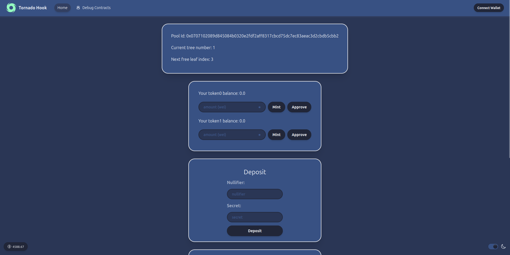

# Tornado Hook

A Tornado Cash implementation as a Uniswap v4 hook.

The project implements both the privacy-preserving mechanism of Tornado Cash and the AMM design of Uniswap v4.

It provides three key benefits:

 - **Privacy:** Mixes users' funds to hide their identity.
 - **Yield**: Users earn fees by providing liquidity, while mixing their funds.
 - **Liquidity**: A larger TVL for traders.

This project relies on an updated Circom circuit of Tornado Cash (using Poseidon hashing with some small optimizations) and Noir for zk-verification.

Due to limitations of the `PoolManager` contract, deposits and withdrawals should be performed through the `TornadoHookEntry` contract.

**No partner integrations.**



## Deployment

The project is deployed on Unichain Sepolia.

The hook contract: `0x84Ad671111481c0FcCDDD232df1092C0B1CC4D03`

The entry contract: `0x37398add74fE0e5c7007Ea67644723BEfe8818A3`

The frontend: https://tornadohook.vercel.app/

## How to create a proof

The actual nullifier and secret are computed as `keccak256(input) % FIELD_SIZE`,
where `input` is a string from the frontend and `FIELD_SIZE = 0x30644e72e131a029b85045b68181585d2833e84879b9709143e1f593f0000001`.

### Circom

To create a proof, first install [snarkjs](https://docs.circom.io/getting-started/installation/#installing-snarkjs), then follow these steps:

 1. Open  `packages/circuits/circom/main_js/input.json` and fill it with your inputs.
 2. Go to `cd packages/circuits/circom/main_js`.
 3. Then run `node generate_witness.js main.wasm input.json witness.wtns`.
 4. And run `snarkjs groth16 prove main_0001.zkey ./main_js/witness.wtns proof.json public.json`.
 5. You'll have your proof in `proof.json`, then `abi.encode` it to send to the contract.

Check `packages/foundry/test/TornadoHook.t.sol` for more details.

### Noir

To create a proof, first install [bb](https://barretenberg.aztec.network/docs/getting_started), then follow these steps:

 1. Open  `packages/circuits/noir/Prover.toml` and fill it with your inputs.
 2. Go to `cd packages/circuits/noir`.
 3. Then run `bb prove -b ./target/noir.json -w ./target/noir.gz -o ./target --oracle_hash keccak --output_format bytes_and_fields`.
 4. You'll have your proof in `./target/proof` and `./target/proof_fields.json`.

Check `packages/foundry/test/TornadoHook.t.sol` for more details.

## Local testing

To run tests, simply go to `cd packages/foundry` and run `forge test -vvv`.

Unfortunately, there are no withdrawal fuzz tests, because for every deposit you need to create a proof, which can't be done in Solidity.

## Local setup

To run Tornado Hook locally, follow the steps below:

1. Install dependencies if it was skipped in CLI:

```
yarn install
```

2. Run a local network in the first terminal:

```
yarn chain
```

This command starts a local Ethereum network using Foundry. The network runs on your local machine and can be used for testing. You can customize the network configuration in `packages/foundry/foundry.toml`.

3. On a second terminal, deploy the contracts:

```
yarn deploy
```

This command deploys the smart contracts to the local network. The contracts are located in `packages/foundry/contracts`. The `yarn deploy` command uses the deploy script located in `packages/foundry/script` to deploy the contract to the network.

4. On a third terminal, start the NextJS app:

```
yarn start
```

Visit the app on: `http://localhost:3000`. You can interact with the smart contracts using the `Debug Contracts` page. You can tweak the app config in `packages/nextjs/scaffold.config.ts`.